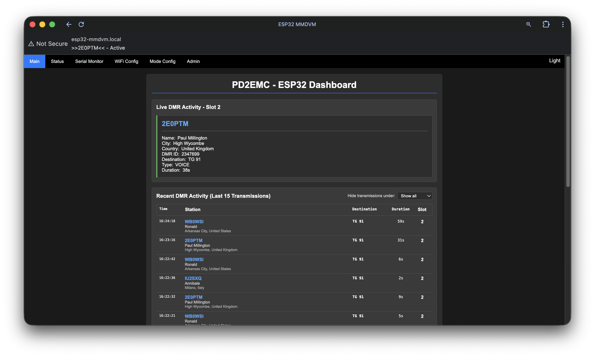
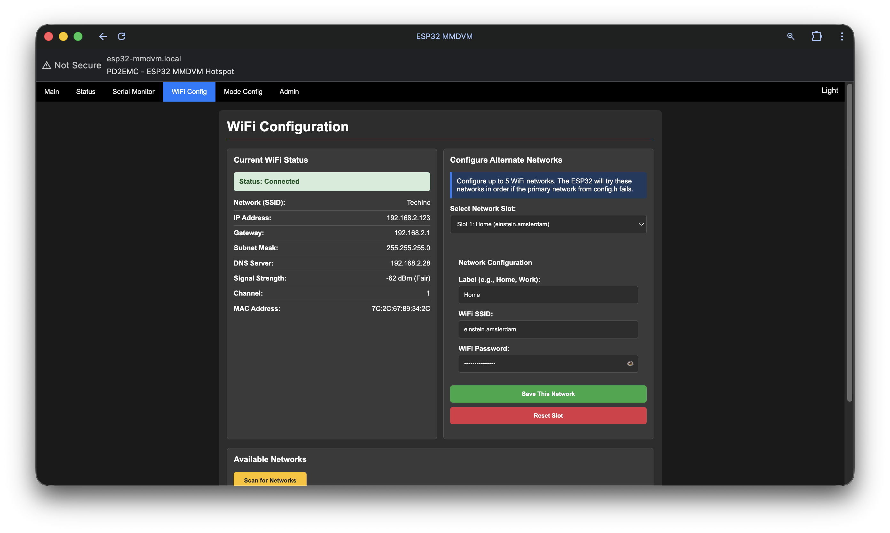
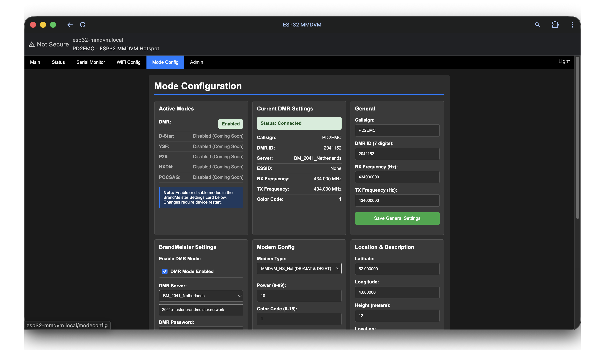
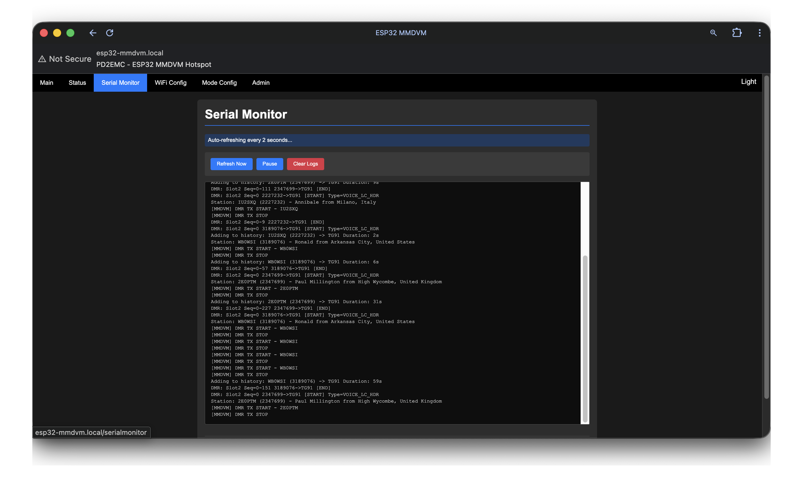
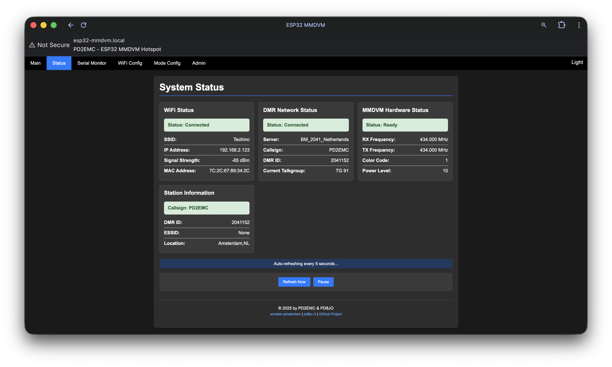
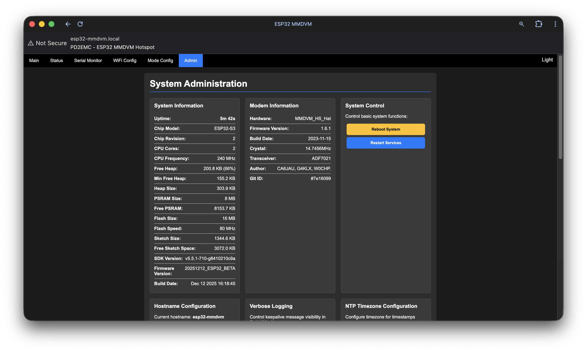

# ESP32 MMDVM Hotspot

A professional ESP32-based DMR hotspot with MMDVM modem support, real-time web interface, and BrandMeister network integration. **Network → RF transmission confirmed working!**

## Table of Contents

**Getting Started**
- [Project Status](#project-status)
- [Hardware Requirements](#hardware-requirements)
- [Pin Configuration](#pin-configuration)
- [Quick Start](#quick-start)
  - [Hardware Setup](#1-hardware-setup)
  - [Software Installation](#2-software-installation)
  - [Configuration](#3-configuration)
  - [Upload Firmware](#4-upload-firmware)
  - [First Time Setup](#5-first-time-setup)

**Using the Hotspot**
- [How It Works](#how-it-works)
- [Web Interface Features](#web-interface-features)
- [DMR Network Support](#dmr-network-support)
- [BrandMeister Server List](#brandmeister-server-list)

**Advanced Topics**
- [Advanced Features](#advanced-features)
- [Hardware Configuration](#hardware-configuration)
- [Network Configuration](#network-configuration)
- [Troubleshooting](#troubleshooting)
- [Development Information](#development-information)

**Legal & Community**
- [License](#license)
- [Legal and Safety Information](#legal-and-safety-information)
- [Contributing](#contributing)
- [Support and Community](#support-and-community)
- [Resources and Documentation](#resources-and-documentation)

## Project Status

**Current Release:** Beta - December 12, 2025  
**Firmware Version:** 20251212_ESP32_BETA

### Confirmed Working
- **Network → RF Transmission** - Receive DMR from BrandMeister and transmit over RF (user verified!)
- **Full DMR Protocol** - BrandMeister network integration with SHA256 authentication
- **MMDVM Communication** - Complete protocol implementation (115200 baud, GPIO 43/44/13)
- **Real-time User Lookup** - RadioID.net API integration with callsign/name/location
- **DMR Activity Display** - Live transmission monitoring with dual-slot support
- **Transmission History** - Last 15 DMR transmissions with duration tracking
- **Professional Web Interface** - Responsive design with dark/light themes
- **Multi-Network WiFi** - Primary + 5 backup networks with auto-failover
- **OLED Display** - Real-time status on 128x64 SSD1306 (optional)
- **RGB LED Indicators** - Visual TX/RX status feedback (GPIO 40/41/42)
- **Configuration Management** - Import/export, backup/restore
- **OTA Updates** - GitHub download + file upload
- **Debug Controls** - Toggle verbose logging (DEBUG_MMDVM, DEBUG_NETWORK)

### In Development
- **RF → Network Path** - Receive DMR from radio and forward to network (RX path)
- **RSSI Monitoring** - Signal strength reporting from modem

### Planned Features
- **D-Star** - D-Star network and protocol support
- **YSF/Fusion** - System Fusion protocol
- **P25** - Project 25 digital voice
- **NXDN** - NXDN protocol
- **POCSAG** - Paging support

## Hardware Requirements

### Tested & Confirmed Working
- **Board:** LILYGO T-ETH-Elite ESP32-S3 with MMDVM HS Hat
- **MMDVM Firmware:** MMDVM_HS_Hat-v1.6.1 20231115_WPSD (14.7456MHz ADF7021)
  - Firmware by: CA6JAU, G4KLX, W0CHP
  - GitID: #7e16099
- **Baud Rate:** 115200 (confirmed working)
- **Antenna:** UHF/VHF (e.g., 70cm for 434MHz)

### Compatible Hardware
**ESP32 Boards:**
- ESP32-S3 (LILYGO T-ETH-Elite - recommended)
- ESP32-WROOM-32
- ESP32-WROVER
- Any ESP32 with available UART pins

**MMDVM Modems:**
- MMDVM HS Hat (tested - fully working ✅)
- JumboSPOT
- ZUMspot  
- MMDVM_HS (Hotspot)
- Any MMDVM with 14.7456MHz or 12.288MHz crystal

### Optional Components
- **OLED Display:** SSD1306 128x64 I2C (real-time status)
- **RGB LED:** Visual TX/RX indicators (GPIO 40/41/42)

## Pin Configuration

### MMDVM Connection (LILYGO T-ETH-Elite ESP32-S3) Fits modem on RPI Headers
```
ESP32 GPIO    MMDVM Hat     Function
----------    ---------     --------
GPIO 43       → RX          ESP32 TX to MMDVM RX (sends commands/data)
GPIO 44       ← TX          ESP32 RX from MMDVM TX (receives responses)
GPIO 13       → (Wakeup)    Keeps MMDVM active (requires UART activity)
GPIO 12       ← (LED)       Status LED monitoring (read-only)
GPIO 0        → PTT         Push-to-Talk Control
GPIO 38       → COS/LED     Carrier Detect LED
3.3V          → VCC         Power Supply (3.3V only!)
GND           → GND         Ground
```

**Critical Notes:**
- **GPIO 13 Wakeup:** MMDVM requires continuous UART activity on this pin to stay active
- **Baud Rate:** 115200 confirmed working (SERIAL_8N1)
- **Timing:** UART .flush() after writes is critical for reliability
- **Voltage:** 3.3V only - DO NOT use 5V

### OLED Display (Optional)
```
ESP32 GPIO    OLED Display  Function
----------    ------------  --------
GPIO 17       → SDA         I2C Data
GPIO 18       → SCL         I2C Clock
3.3V          → VCC         Power Supply
GND           → GND         Ground
```

### RGB LED (Optional)
```
ESP32 GPIO    LED Color     Function
----------    ---------     --------
GPIO 41       → Red         Status indicator
GPIO 40       → Green       TX indicator
GPIO 42       → Blue        RX indicator
```

## Quick Start

### 1. Hardware Setup
1. Connect your MMDVM hat to ESP32 according to pin configuration
2. Connect antenna to MMDVM hat
3. Power the ESP32 via USB or external supply

### 2. Software Installation

#### Arduino IDE Setup
1. Download Arduino IDE from: https://www.arduino.cc/en/software
2. Install ESP32 board support:
   - File → Preferences
   - Add to "Additional Board Manager URLs":
     ```
     https://raw.githubusercontent.com/espressif/arduino-esp32/gh-pages/package_esp32_index.json
     ```
   - Tools → Board → Board Manager
   - Search "ESP32" and install "ESP32 by Espressif Systems"

#### Required Libraries

**Built-in ESP32 Libraries** (no installation needed):
- WiFi (WiFi network connectivity)
- WebServer (Professional web interface)
- ESPmDNS (Network discovery)
- Preferences (Configuration storage with NVS)
- HTTPClient (OTA firmware downloads from GitHub)
- Update (OTA firmware flashing)
- WiFiClientSecure (Secure HTTPS connections)
- mbedtls (SHA256 cryptographic authentication)
- nvs_flash (NVS partition management for factory reset)

**Additional Libraries** (install via Arduino Library Manager):
- **Adafruit GFX Library** (for OLED display graphics)
- **Adafruit SSD1306** (for OLED display driver)

To install in Arduino IDE:
1. Go to Sketch → Include Library → Manage Libraries
2. Search for "Adafruit GFX" and click Install
3. Search for "Adafruit SSD1306" and click Install

### 3. Configuration

**No configuration required!** The firmware includes default WiFi credentials, but if you're compiling from source, you can optionally edit `config.h`:

```cpp
// WiFi Configuration (OPTIONAL - defaults will work)
#define WIFI_SSID "YourWiFiNetwork"
#define WIFI_PASSWORD "YourWiFiPassword"

// Fallback Access Point (if WiFi fails)
#define AP_SSID "ESP32-MMDVM-Config"
#define AP_PASSWORD "mmdvm1234"
```

**If you're flashing a pre-compiled .bin file:** Skip this step! The ESP32 will automatically start in Access Point mode on first boot, allowing you to configure up to 5 WiFi networks through the web interface.

**Optional config.h settings** (defaults work for most users):

```cpp
// Hardware Pins (pre-configured for LILYGO T-ETH-Elite ESP32-S3)
#define MMDVM_RX_PIN 44              // ESP32 RX from MMDVM TX
#define MMDVM_TX_PIN 43              // ESP32 TX to MMDVM RX
#define MMDVM_WAKEUP_PIN 13          // Keeps MMDVM active
#define MMDVM_SERIAL_BAUD 115200     // MMDVM baud rate

// Display (optional)
#define ENABLE_OLED true             // Enable OLED display
#define OLED_I2C_ADDRESS 0x3C        // Usually 0x3C or 0x3D

// Debug Options (set false for clean logs)
#define DEBUG_MMDVM false            // MMDVM TX frame debug
#define DEBUG_NETWORK false          // Network keepalive debug
```

**All DMR settings are configured via web interface:**
- Callsign, DMR ID, Password
- BrandMeister server selection
- RX/TX frequencies and power
- Color code
- Location and description
- Mode enable/disable (DMR, D-Star, etc.)

Settings are automatically saved to ESP32 NVS storage and persist across reboots.

### 4. Upload Firmware
1. Select: Tools → Board → "ESP32 Dev Module"
2. Select your COM port: Tools → Port
3. Click Upload button
4. Monitor serial output at 115200 baud

### 5. First Time Setup

**Step 1: Connect to WiFi**
On first boot, the ESP32 will:
1. Try to connect to WiFi (if configured in `config.h` during compilation)
2. If no WiFi is configured or connection fails, automatically create access point: **ESP32-MMDVM-Config**
3. Connect your phone/laptop to the AP with password: **mmdvm1234**
4. Open browser to: **http://192.168.4.1**
5. Go to **WiFi Configuration** page and configure up to 5 WiFi networks:
   - Primary network (Home)
   - Backup slots: Mobile, Work, Friends, Other
   - Use built-in WiFi scanner to discover nearby networks
6. ESP32 will automatically connect to the first available network and remember all 5

**Step 2: Configure DMR Settings (Web Interface)**
Once connected to WiFi, access the web interface:
1. Navigate to **Mode Configuration** page
2. Enter your DMR credentials:
   - Callsign (from your amateur radio license)
   - DMR ID (7-digit number from RadioID.net)
   - Password (from BrandMeister self-care)
3. Select BrandMeister server (closest to your location)
4. Set RX/TX frequency (e.g., 434 MHz for 70cm)
5. Set color code (usually 1 for BrandMeister)
6. **Enable DMR mode** (OFF by default to prevent spam)
7. Click **Save DMR Configuration**

**Step 3: Verify Operation**
- Settings are automatically saved to ESP32 NVS storage
- ESP32 will reboot and connect to BrandMeister
- Monitor Serial Monitor for "DMR TX START" to confirm RF transmission
- Check web dashboard for "DMR Network: Connected"

**Note:** All settings persist across reboots. You only need to configure them once unless you want to change something.

## How It Works

### Network → RF Transmission Path (Working!)
When someone transmits on BrandMeister network:

1. **Network Packet** - ESP32 receives DMRD packet from Brand Meister (UDP port 62031)
2. **User Lookup** - RadioID.net API fetches callsign/name/location (cached for performance)
3. **Activity Display** - Web interface and OLED show live transmission
4. **DMR START Command** - ESP32 sends `CMD_DMR_START (0x1D)` to put modem in TX mode
5. **Frame Transmission** - DMR frames sent to modem via `CMD_DMR_DATA2 (0x1A)` with 55ms delay
6. **RF Output** - MMDVM modem transmits on configured frequency
7. **TX END** - After 500ms timeout, sends `CMD_DMR_START (0x00)` to exit TX mode
8. **History Logging** - Transmission added to history with duration

**Example Log:**
```
[SERVER] DMR: Slot2 Seq=1 4040888->TG91 [START] Type=VOICE_LC_HDR
[INFO] Station: VU3LQE (4040888) - Subhosmito from Kolkata, India
[MMDVM] DMR TX START - VU3LQE
[MMDVM] DMR TX STOP
[HISTORY] Adding to history: VU3LQE (4040888) -> TG91 Duration: 10s
[SERVER] DMR: Slot2 Seq=1-129 4040888->TG91 [END]
```

### Critical Timing
- **DMR Frame Timing:** 60ms between frames
- **Buffer Prevention:** 55ms delay after each frame prevents modem buffer overflow
- **TX Timeout:** 500ms without frames triggers automatic TX stop
- **Single START:** Only one DMR_START per transmission (not per frame)

### Configuration Storage
All settings configured via web interface are stored in **ESP32 NVS (Non-Volatile Storage)**:
- **WiFi Networks:** Primary + 5 backup networks
- **DMR Credentials:** Callsign, ID, password, server
- **RF Settings:** Frequencies, power, color code
- **Location Data:** Coordinates, description
- **Mode Settings:** Enable/disable DMR, D-Star, etc.
- **Web Credentials:** Username/password
- **System Settings:** Hostname, verbose logging, timezone

Settings are loaded automatically on boot and persist across power cycles. Use **Export Config** to backup settings or **Factory Reset** to erase all stored data.

## Web Interface Features

Once connected, access the web interface at the ESP32's IP address. Default login: **admin / pi-star**

### Home Dashboard (`/`)
The main landing page provides comprehensive real-time monitoring:



**Live DMR Activity Cards:**
- **Dual-slot display** for real-time transmissions (Slot 1 & Slot 2)
- **Active transmission details:**
  - Callsign with QRZ.com lookup link
  - DMR ID
  - Name, City, Country (from RadioID.net)
  - Destination (Talkgroup/Private Call)
  - Frame type (Voice/Data)
  - Live duration counter
- **Idle state** when no transmission active

**Recent DMR Activity (Last 15 Transmissions):**
- **Filterable history table** with duration filter (0.5s to 5s)
- Timestamp, Station (Callsign/Name/Location), Destination, Duration, Slot
- QRZ.com links for all callsigns
- Sorted newest-first with detailed station information

**System Status Overview:**
- **Network Connectivity:** WiFi status (Connected/AP Mode/Disconnected), Ethernet (T-ETH-Elite only)
- **System Status:** MMDVM hardware ready, DMR network connection
- **Digital Modes:** Visual toggle switches showing DMR (functional), D-Star/YSF/P25/NXDN/POCSAG (not implemented)
- **Auto-refresh:** Activity (1s), History (2s), Status (3s)
- **Dynamic title:** Shows active callsigns in browser tab when transmitting

### WiFi Configuration (`/wificonfig`)



**Current WiFi Status:**
- **Connection Details** - SSID, IP address, Gateway, Subnet Mask, DNS Server
- **Signal Quality** - RSSI in dBm with assessment (Excellent/Good/Fair/Weak)
- **Network Info** - WiFi channel, MAC address
- **AP Mode Status** - When in Access Point mode, shows AP SSID, IP, and connected client count

**Multi-Network Management:**
- **5 Alternate Network Slots** - Configure up to 5 WiFi networks with custom labels
- **Slot Editor** - Switch between slots to configure each network independently
- **Network Labels** - Customize slot names (e.g., Home, Mobile, Work, Friends, Other)
- **Password Visibility Toggle** - Show/hide password when configuring networks
- **Automatic Failover** - ESP32 tries networks in order (Slot 1 → Slot 5) if primary from config.h fails
- **Reset Slot Function** - Clear individual slots back to default labels and empty credentials

**Network Scanner:**
- **WiFi Discovery** - Scan and display nearby networks with signal strength
- **Quick Selection** - Click any network to auto-fill SSID in slot editor
- **Security Status** - Shows Open vs Secured networks
- **Signal Strength** - RSSI values for each discovered network

### DMR Configuration (`/modeconfig`)  



**Active Modes Status Card:**
- **DMR Mode** - Real-time status badge (Enabled/Disabled with green/red indicator)
- **Future Modes** - D-Star, YSF, P25, NXDN, POCSAG displayed as "Coming Soon" (read-only, dimmed)
- **Toggle Control** - DMR enable/disable checkbox in BrandMeister Settings card
- **Restart Required** - Changes activate after device reboot

**Current DMR Settings Overview:**
- **Network Status** - BrandMeister connection status (Connected/Disconnected badge)
- **Station Identity** - Callsign and DMR ID display
- **Server Information** - Current BrandMeister server with friendly name
- **ESSID Display** - Radio ID suffix (None or 1-99)
- **RF Parameters** - RX/TX frequencies in MHz, Color Code
- **Quick Reference** - All current settings at a glance before making changes

**General Settings Card:**
- **Callsign Configuration** - Amateur radio callsign (e.g., N0CALL)
- **DMR ID** - 7-digit ID with validation (1000000-9999999)
- **RX Frequency** - Receive frequency in Hz (400-480 MHz range)
- **TX Frequency** - Transmit frequency in Hz (400-480 MHz range)
- **Save General** - Independent save button preserves other settings

**BrandMeister Settings Card:**
- **DMR Mode Toggle** - Large checkbox to enable/disable DMR connection
- **Server Selector** - Dropdown with 40+ worldwide servers plus "Custom Server" option
  - Europe: Netherlands, Germany, UK, France, Italy, Spain, Belgium, Austria, Switzerland, Denmark, Sweden, Norway, Finland, Czech Republic, Hungary, Romania, Poland, Portugal, Ireland, Bulgaria, Slovenia, Russia, Ukraine, Greece
  - North America: USA (3 servers), Canada, Mexico
  - Asia-Pacific: Australia, South Korea, China, Malaysia, Philippines
  - Middle East/Africa: Israel, South Africa
  - South America: Brazil, Chile
- **Custom Server Entry** - Manual IP or FQDN input when "Custom Server" selected
- **Server Auto-fill** - Selecting predefined server auto-populates server field
- **DMR Password** - BrandMeister hotspot password with visibility toggle (show/hide)
- **ESSID Configuration** - Radio ID suffix dropdown (0=None, 1-99)
- **Save BrandMeister** - Independent save button preserves other settings

**Modem Config Card:**
- **Modem Type Selector** - Dropdown with 11 hardware variants:
  - MMDVM_HS_Hat (GPIO / GPIO 1.2)
  - MMDVM_HS_Dual_Hat (GPIO / GPIO 1.2 / 14.7456 MHz)
  - HS_HAT with AMBE/SkyBridge chip
  - HS_DUAL_HAT with AMBE chip
  - Nano hotSPOT / NanoDV (BI7JTA)
  - D2RG MMDVM_HS RPi Hat
- **Power Control** - RF power level (0-99) with validation
- **Color Code** - DMR color code (0-15) with validation
- **Save Modem Config** - Independent save button preserves other settings

**Location & Description Card:**
- **GPS Coordinates** - Latitude/Longitude with 6 decimal places precision
- **Height** - Elevation in meters (0-999)
- **Location Text** - City, Country display (max 20 characters)
- **Description** - Station description (max 19 characters)
- **URL** - Station website or info page (max 124 characters)
- **Save Location** - Independent save button preserves other settings

**User Experience Features:**
- **Server Dropdown Logic** - Auto-updates text field when server selected from list
- **Password Toggle** - Eye icon to show/hide password in BrandMeister Settings
- **Independent Forms** - Each card saves separately without affecting other settings
- **Hidden Field Preservation** - Each form includes hidden fields to preserve other cards' values
- **Server Tips** - Inline help: choose closest server, port 62031 default, get password from brandmeister.network
- **Validation** - Client-side and server-side validation for DMR ID (7 digits), ESSID (0-99), frequencies (400-480 MHz)
- **Save Confirmation** - Success page shows new settings and auto-redirects after 5 seconds
- **Automatic Restart** - Device restarts after save to apply new DMR configuration

### Serial Monitor (`/serialmonitor`)



**Real-time Log Display:**
- **Live Log Feed** - Auto-refreshing display updates every 2 seconds
- **Circular Buffer** - Stores 50 most recent log messages (oldest first display order)
- **Terminal-Style UI** - Dark background (#0e0e0e) with monospace Courier New font
- **Auto-Scroll** - Automatically scrolls to newest log entries on refresh
- **Log Content** - MMDVM communication, network packets, authentication status, debug info

**Interactive Controls:**
- **Refresh Now Button** - Manual immediate log update
- **Pause/Resume Toggle** - Stop/start auto-refresh (button text changes dynamically)
- **Clear Logs Button** - Erase all stored logs with confirmation dialog
- **Status Indicator** - Shows current state ("Auto-refreshing every 2 seconds..." or "Auto-refresh paused")

**Technical Features:**
- **JavaScript Auto-Refresh** - setInterval updates logs without page reload
- **Fetch API** - Asynchronous log retrieval from `/logs` endpoint
- **Error Handling** - Console logging for failed fetch requests
- **Responsive Design** - Scrollable container (400px min, 600px max height)
- **Color Coding** - Log lines displayed in #cccccc on dark terminal background

### Status Page (`/status`)



**WiFi Status Card:**
- **Connection Status** - Visual badge (Connected/AP Mode/Disconnected)
- **Connected Mode** - SSID, IP address, Signal strength (RSSI in dBm), MAC address
- **AP Mode** - Access Point IP address, connected client count
- **Real-time Updates** - Status refreshes every 5 seconds

**Ethernet Status Card** (LILYGO T-ETH-Elite only):
- **Connection Status** - Visual badge (Connected/Not Connected)
- **Network Details** - IP address, MAC address, Gateway IP
- **Link Information** - Link speed in Mbps, Duplex mode (Full/Half)
- **Connection Info** - Cable status and connection state

**SD Card Status Card** (LILYGO T-ETH-Elite only):
- **Availability Status** - Visual badge (Available/Not Available)
- **Card Type** - MMC, SD, SDHC, or Unknown
- **Storage Metrics** - Total size, Used space, Free space (all in MB)
- **Insertion Detection** - Shows "No card inserted" when unavailable

**DMR Network Status Card:**
- **BrandMeister Connection** - Visual badge (Connected/Disconnected) with login status
- **Server Information** - Current BrandMeister server with friendly name
- **Station Identity** - Callsign and DMR ID
- **ESSID Display** - Radio ID suffix if configured
- **Current Talkgroup** - Active TG or "None" when idle

**MMDVM Hardware Status Card:**
- **Hardware Ready State** - Visual badge (Ready/Not Ready)
- **RF Configuration** - RX/TX frequencies in MHz (3 decimal precision)
- **DMR Settings** - Color code and power level
- **Real-time Status** - Hardware state updates automatically

**Station Information Card:**
- **Callsign Configuration Status** - Green badge if configured, red if still default "N0CALL"
- **DMR Credentials** - DMR ID and ESSID display
- **Location** - Station location text
- **Configuration Warning** - Visual indicator for unconfigured callsign

**Interactive Controls:**
- **Auto-Refresh** - Updates all cards every 5 seconds
- **Refresh Now Button** - Manual immediate status update
- **Pause/Resume Toggle** - Stop/start auto-refresh (button text changes dynamically)
- **Status Indicator** - Shows "Auto-refreshing every 5 seconds..." or "Auto-refresh paused"

**Technical Features:**
- **Grid Layout** - Responsive auto-fit cards (minimum 250px width)
- **Fetch API** - Asynchronous updates from `/statusdata` endpoint
- **Conditional Display** - Ethernet and SD card sections only show on T-ETH-Elite hardware
- **Status Badges** - Color-coded visual indicators (green=connected, yellow=warning, red=disconnected)
- **JavaScript Auto-Refresh** - setInterval updates without page reload
- **Error Handling** - Console logging for failed fetch requests

### Admin Panel (`/admin`)



**System Information Card:**
- **System Uptime** - Days, hours, minutes, seconds display with blue highlighting
- **ESP32 Details** - Chip model, revision, CPU cores, CPU frequency
- **Memory Metrics** - Free heap, minimum free heap, heap size, free PSRAM (if available)
- **Flash Information** - Flash size, flash speed, sketch size, free sketch space
- **SDK & Firmware** - SDK version, firmware version, build date/time
- **Real-time Updates** - All metrics refresh dynamically

**Modem Information Card:**
- **Hardware Identification** - Modem hardware type (e.g., MMDVM_HS_Hat)
- **Firmware Details** - Parsed modem firmware version
- **Build Information** - Formatted build date (YYYY-MM-DD)
- **Crystal Frequency** - Crystal specification (e.g., 14.7456MHz)
- **Transceiver Chip** - RF chip type (e.g., ADF7021)
- **Author** - Firmware author information
- **Git Commit ID** - Exact firmware build identifier

**System Control Card:**
- **Reboot System** - Full ESP32 restart with confirmation dialog
- **Restart Services** - Restart DMR/network services without full reboot
- **Vertical Button Layout** - Easy access to system actions

**Hostname Configuration Card:**
- **Current Hostname Display** - Shows active mDNS hostname
- **Access URL** - Shows http://[hostname].local for easy reference
- **Hostname Editor** - Input field with validation (letters, numbers, hyphens, 1-32 chars)
- **Auto-Redirect** - Redirects to new URL after save and reboot
- **Save Button** - Applies hostname change with automatic reboot

**Verbose Logging Card:**
- **Current Status Display** - Shows Enabled/Disabled state
- **Purpose Explanation** - Controls RPTPING/MSTPONG keepalive message visibility
- **Checkbox Toggle** - Simple enable/disable interface
- **Serial Monitor Integration** - Affects what appears in /serialmonitor logs

**NTP Timezone Configuration Card:**
- **Current Offset Display** - Shows timezone offset in hours from UTC
- **DST Offset Display** - Shows daylight saving time offset in hours
- **Timezone Selector** - Dropdown with 25 timezone options (UTC-12 to UTC+12)
- **Named Timezones** - Includes common names (PST, EST, CET, AEST, etc.)
- **DST Checkbox** - Enable/disable Daylight Saving Time (+1 hour)
- **Save Button** - Applies timezone changes with reload

**Web Username Card:**
- **Current Username Display** - Shows active web interface username in info box
- **Username Editor** - Text input with validation (minimum 3 characters)
- **Change Confirmation** - Warns user they'll need to re-login
- **Auto-Logout** - Redirects to login after successful change

**Web Password Card:**
- **Current Password Display** - Masked (********) with toggle to show/hide
- **Password Visibility Toggle** - Eye icon to reveal actual password
- **New Password Field** - Password input with show/hide toggle
- **Confirm Password Field** - Validation input with show/hide toggle
- **Minimum Length** - 4 characters required with validation
- **Password Matching** - Client-side validation before submission
- **Change Confirmation** - Warns user they'll need to re-login with new password

**Configuration Management Card:**
- **Reset All Settings** - Complete factory reset button (links to /resetconfig with extreme warnings)
- **Export Config** - Download current settings as mmdvm-config.txt file
- **Import Config** - Upload configuration file to restore settings
- **Show Preferences** - View all NVS storage (links to /showprefs)
- **Import Area Toggle** - Expandable file upload interface with warning
- **Vertical Button Layout** - Organized action buttons

**Maintenance Card:**
- **Clear Logs** - Erase all serial monitor logs with confirmation
- **Test MMDVM** - Run MMDVM hardware test (check Serial Monitor for results)
- **Fix Corrupted Prefs** - Clean up and reload preferences from config.h defaults
- **Service Actions** - System maintenance without full restart

**OTA Firmware Updates Card:**
- **Version Display** - Current firmware version and build date/time
- **Online Version Check** - Shows latest Stable and Beta versions available
- **Version Selector** - Dropdown to choose Stable or Beta (auto-selects Beta if current is Beta)
- **Online Update** - Download firmware from GitHub with progress bar
- **File Upload** - Manual .bin file upload interface
- **Progress Tracking** - Visual progress bar with percentage and elapsed time
- **Three-Step Process** - Download → Upload → Flash workflow
- **Update Status Display** - Real-time feedback area for all operations
- **Version Detection** - Auto-selects appropriate branch based on current version

**Complete Storage Reset System:**
- **Dedicated Reset Page** - `/resetconfig` with extreme warnings
- **Multi-Level Warnings** - Danger and warning boxes explaining consequences
- **Erase Details** - Lists everything that will be deleted (DMR config, WiFi, location, NVS partition)
- **Final Confirmation** - JavaScript confirm dialog before proceeding
- **Complete Erasure** - Clears all known namespaces, erases NVS partition, wipes WiFi credentials
- **Auto-Reboot** - 5-second countdown with spinner animation
- **Reinstallation** - Returns to factory config.h defaults

**JavaScript Functionality:**
- **Form Submission Handlers** - All forms use Fetch API for asynchronous submissions
- **Password Toggles** - Show/hide functionality for all password fields
- **Validation** - Client-side checks before server submission
- **Confirmation Dialogs** - Prevent accidental destructive actions
- **Auto-Reload/Redirect** - Automatic page updates after settings changes
- **Progress Animations** - Visual feedback for long-running operations
- **Error Handling** - Alert dialogs for failures with descriptive messages

**Security Features:**
- **HTTP Basic Authentication** - Required on all admin pages
- **Password Masking** - All password displays masked by default with toggle
- **Confirmation Prompts** - Double-check for destructive actions
- **Re-login Required** - Forces re-authentication after credential changes
- **Safe Defaults** - Prevents accidental system-breaking changes

### Dark/Light Theme System
**Professional UI Theming:**
- Toggle between dark and light modes via navigation button
- Theme preference stored in browser localStorage
- Consistent theming across all pages
- Smooth transitions with CSS variables
- Professional appearance without decorative elements

### Web Authentication System
**Security Features:**
- HTTP Basic Authentication on all pages
- Configurable username/password via config.h or web interface
- Default credentials: admin / pi-star
- Password change functionality in admin panel
- Secure credential storage in ESP32 NVS

## DMR Network Support

### Authentication Flow
1. **RPTL** - Initial login with DMR ID
2. **RPTK** - SHA256 authentication with salt+password
3. **RPTC** - Configuration packet with station details
4. **RPTPING** - Keepalive every 5 seconds

### Network Protocols
- Full BrandMeister protocol implementation
- DMRplus compatibility
- Custom server support with manual configuration
- Automatic reconnection on network failures

## BrandMeister Server List

The web interface includes 40+ servers worldwide:

**Europe:** Netherlands (2041), Germany (2621/2622), UK (2341), France (2081/2082), Italy (2222), Spain (2141), Belgium (2061), Austria (2322), Switzerland (2282), Denmark (2382), Sweden (2402), Norway (2421), Finland (2441), Czech Republic (2302), Hungary (2162), Romania (2262), Poland (2602), Portugal (2682), Ireland (2721), Bulgaria (2841), Slovenia (2931), Russia (2502/2503), Ukraine (2551), Greece (2022)

**North America:** USA (3102/3103/3104), Canada (3021), Mexico (3341)

**Asia-Pacific:** Australia (5051), South Korea (4501), China (4602), Malaysia (5021), Philippines (5151)

**Middle East/Africa:** Israel (4251), South Africa (6551)

**South America:** Brazil (7242), Chile (7301)

All servers use standard BrandMeister port 62031.

## Advanced Features

### Multi-Network WiFi Management
```cpp
// Primary WiFi (configured in config.h)
#define WIFI_SSID "YourNetwork"
#define WIFI_PASSWORD "YourPassword"

// WiFi Network Structure
struct WiFiNetwork {
  String label;    // User-friendly name (Home, Mobile, Work, Friends, Other)
  String ssid;     // Network SSID
  String password; // Network password
};

// 5 Backup WiFi Networks (configured via web interface)
WiFiNetwork wifiNetworks[5];
// Stored in ESP32 Preferences as:
// - alt_label1-5, alt_ssid1-5, alt_password1-5
// - Automatic failover in labeled order
// - Web-based configuration with network scanner
```

### Configuration Storage System
**ESP32 NVS Preferences:**
- WiFi networks (primary + 5 backups)
- DMR credentials and server settings
- Web interface credentials
- Theme preferences and system settings
- Automatic corruption detection and repair

### OTA Update System
**Dual Method Support:**
1. **GitHub Integration**
   - Automatic version checking via OTA_VERSION_URL
   - Secure HTTPS download from OTA_UPDATE_URL
   - Progress indication and error handling
   
2. **File Upload**
   - Web browser-based firmware upload
   - Direct .bin file flashing
   - Validation and verification

**Security Features:**
- HTTPS-only downloads for GitHub updates
- File size and format validation
- Rollback capability on failed updates
- Progress monitoring with status feedback

## Hardware Configuration

### GPIO Pin Assignments
```cpp
// MMDVM Serial Communication (LILYGO T-ETH-Elite ESP32-S3)
#define MMDVM_RX_PIN 44        // ESP32 RX from MMDVM TX
#define MMDVM_TX_PIN 43        // ESP32 TX to MMDVM RX
#define MMDVM_WAKEUP_PIN 13    // Keeps MMDVM active
#define MMDVM_PTT_PIN 0        // Push-to-Talk control
#define MMDVM_COS_LED_PIN 38   // Carrier detect LED

// OLED Display (I2C)
#define OLED_SDA_PIN 17        // I2C Data
#define OLED_SCL_PIN 18        // I2C Clock

// RGB LED Indicators
#define RGB_RED_PIN 41         // Red LED
#define RGB_GREEN_PIN 40       // Green LED (TX)
#define RGB_BLUE_PIN 42        // Blue LED (RX)
```

### Serial Configuration
```cpp
#define MMDVM_SERIAL_BAUD 115200    // MMDVM communication speed
// Uses Serial2 for MMDVM communication
// Serial (USB) for debug output at 115200 baud
```

### LED Status Indicators

#### Standard Status LED (GPIO 2)
- **OFF** - System starting up
- **STEADY** - Connected to WiFi and DMR network
- **FAST_BLINK** - Connecting to WiFi
- **SLOW_BLINK** - Access Point mode active
- **Automatic Control** - LED state managed by setLEDMode() and updateStatusLED() functions

#### RGB LED Status Indicator (Optional)

**Hardware Setup:**
Connect RGB LEDs to the following pins:
- Red LED: GPIO 41
- Green LED: GPIO 40
- Blue LED: GPIO 42

**Configuration (config.h):**
```cpp
// RGB LED Settings
#define ENABLE_RGB_LED true          // Enable/disable RGB LED
#define RGB_LED_BRIGHTNESS 25        // Overall brightness (25 = ~10%)
#define RGB_LED_IDLE_BRIGHTNESS 10   // Idle state brightness (dim)
#define RGB_LED_ACTIVE_BRIGHTNESS 50 // TX/RX brightness (brighter but still dimmed)
```

**Status Colors:**

| Status | Color | Brightness | When |
|--------|-------|------------|------|
| **Disconnected** | Red | Dim (10) | No network connection |
| **AP Mode** | Purple | Dim (10) | Access Point mode active |
| **Connecting** | Blue blinking | Flashing | Connecting to network |
| **Network Connected** | Blue | Very dim (10) | Connected but idle |
| **Transmitting** | Green | Medium (50) | TX - Sending to network |
| **Receiving** | Red | Medium (50) | RX - Receiving from network |

**Features:**
- **Dimmed by default** - All colors use the brightness settings you can adjust in config.h
- **PWM control** - Smooth brightness control using ESP32 hardware PWM
- **Activity feedback** - Flashes green when transmitting, red when receiving
- **Network status** - Shows connection state at a glance
- **Non-blocking** - Uses PWM so it doesn't affect performance

**Files:**
- `RGBLedController.h` - RGB LED controller class
- `config.h` - LED configuration settings
- `esp32_mmdvm_hotspot.ino` - Integrated LED control

**Brightness Adjustment:**
Edit the values in config.h to adjust brightness:
- Lower numbers = dimmer (recommended for bright LEDs)
- Higher numbers = brighter
- Range: 0-255 (0=off, 255=full brightness)

## Network Configuration

### WiFi Failover Logic
1. Try primary WiFi from config.h
2. If failed, try backup networks 1-5 in order
3. If all networks fail, start Access Point mode
4. Retry primary network periodically while in AP mode

### DMR Network Settings
```cpp
// Example BrandMeister configuration
#define DMR_SERVER "44.131.4.1"    // Primary BrandMeister US
#define DMR_PORT 62031              // Standard DMR port
#define LOCAL_PORT 62032            // Local UDP port

// Authentication
#define DMR_CALLSIGN "YourCall"     // Amateur radio callsign
#define DMR_ID 1234567              // 7-digit DMR ID
#define DMR_PASSWORD "yourpass"     // BrandMeister password
```

## Troubleshooting

### Common Issues

#### WiFi Connection Problems
- **Check config.h settings** - Verify SSID/password accuracy
- **Use WiFi scanner** - Access via web interface at 192.168.4.1 in AP mode
- **Signal strength** - Ensure ESP32 is within range of WiFi router
- **Backup networks** - Configure multiple WiFi slots for reliability

#### DMR Authentication Failures
- **Verify credentials** - Check callsign, DMR ID, and password on BrandMeister
- **Server selection** - Try different BrandMeister servers from built-in list
- **Network connectivity** - Ensure internet access for DMR authentication
- **Check serial logs** - Monitor authentication flow via web interface

#### MMDVM Communication Issues
- **Hardware connections** - Verify GPIO pin connections to MMDVM hat
- **Power supply** - Ensure adequate 3.3V power for ESP32 and MMDVM
- **Serial settings** - Confirm 115200 baud rate configuration
- **MMDVM firmware** - Update MMDVM hat firmware if necessary

#### OTA Update Problems
- **Network connectivity** - Ensure stable internet connection
- **GitHub URL** - Verify OTA_UPDATE_URL points to valid .bin file
- **File size** - Check available flash memory for update
- **HTTPS certificates** - Ensure system time is accurate for SSL validation

### Advanced Debugging

#### Serial Monitor Analysis
Monitor ESP32 serial output at 115200 baud for detailed logs:
```
=== ESP32 MMDVM Hotspot ===
Initializing...
WiFi Connected [Primary]!
IP address: 192.168.1.100
DMR Login: RPTL sent
DMR Auth: RPTK sent (SHA256)
DMR Config: RPTC sent
DMR Status: Connected
```

#### Show Preferences Tool
Access `/showprefs` for complete system state:
- All stored WiFi networks (passwords masked)
- DMR configuration settings
- Web interface credentials (passwords masked)
- Theme and system preferences
- NVS storage utilization

#### Factory Reset Procedure
1. Access admin panel at `/admin`
2. Click "Complete Factory Reset" 
3. Confirm erasure of all NVS data
4. System will restart with default settings
5. Reconfigure via Access Point mode

### Performance Optimization

#### Memory Management
- Monitor heap usage via status page
- Clear serial logs periodically
- Restart system services if memory low

#### Network Stability
- Use quality WiFi router with good signal strength
- Configure multiple backup WiFi networks
- Select geographically closest BrandMeister server

#### DMR Performance
- Ensure stable internet connection
- Monitor keepalive status in serial logs
- Verify antenna SWR and connections

## Development Information

### File Structure
```
esp32_mmdvm_hotspot/
├── esp32_mmdvm_hotspot.ino    # Main firmware
├── webpages.h                 # Complete web interface
├── config.h                   # Hardware/network configuration
├── README.md                  # This documentation
├── version.txt                # Current firmware version
├── make-bin.sh               # Build script
└── web/                      # Modular web components (legacy)
    ├── common/
    ├── pages/
    └── handlers/
```

### Key Functions
- `setupWiFi()` - Multi-network WiFi connection with automatic failover
- `handleMMDVMSerial()` - MMDVM protocol processing and packet handling
- `connectToDMRNetwork()` - BrandMeister authentication and connection management
- `handleDownloadUpdate()` - GitHub firmware download with HTTPS validation
- `handleUploadFirmware()` - Web browser file upload with progress tracking
- `handleFlashFirmware()` - Firmware flashing with safety validation
- `handleShowPreferences()` - Advanced NVS storage debugging with password masking
- `handleSaveHostname()` - mDNS hostname configuration management
- `handleSaveVerbose()` - Verbose logging control (keepalive message visibility)
- `handleSaveUsername()` - Web interface username management
- `handleSavePassword()` - Web interface password management
- `handleExportConfig()` - JSON configuration backup generation
- `handleImportConfig()` - JSON configuration restore functionality
- `handleGetLogs()` - Serial log retrieval for web interface display
- `handleClearLogs()` - Clear serial monitor log buffer
- `handleWifiScan()` - WiFi network discovery and RSSI reporting
- `handleSaveModes()` - Digital protocol mode enable/disable management
- `handleReboot()` - System restart functionality
- `handleRestartServices()` - Service restart without full reboot
- `handleSaveConfig()` - WiFi configuration persistence
- `handleSaveDMRConfig()` - DMR settings persistence  
- `handleResetConfig()` - Factory reset confirmation page
- `handleConfirmReset()` - Execute complete NVS erasure
- `setLEDMode()` - Control ESP32 status LED (OFF/STEADY/FAST_BLINK/SLOW_BLINK)
- `updateStatusLED()` - LED state machine for visual status indication
- `sendMMDVMCommand()` - Low-level MMDVM serial communication
- `logSerial()` - Standard logging with web buffer storage
- `logSerialVerbose()` - Conditional verbose logging (keepalive messages)

### Protocol Implementation
- **DMR Protocol** - Complete BrandMeister authentication with SHA256
- **MMDVM Serial** - Full packet processing and command handling (0xE0 frame start)
- **Buffer Management** - 512-byte RX/TX buffers with overflow protection
- **Web Interface** - Professional responsive design with theme system
- **Configuration Management** - ESP32 NVS storage with import/export
- **DMR State Machine** - DISCONNECTED → WAITING_LOGIN → WAITING_AUTH → CONNECTED
- **Serial Log Buffer** - 50-message circular buffer with overflow protection

### config.h
Main configuration file with hardware and network settings:
```cpp
// WiFi Settings
#define WIFI_SSID "YourNetwork"
#define WIFI_PASSWORD "YourPassword"

// DMR Network  
#define DMR_CALLSIGN "N0CALL"
#define DMR_ID 1234567
#define DMR_SERVER "44.131.4.1"

// Hardware Pins (LILYGO T-ETH-Elite ESP32-S3)
#define MMDVM_RX_PIN 44        // ESP32 RX from MMDVM TX
#define MMDVM_TX_PIN 43        // ESP32 TX to MMDVM RX
#define MMDVM_WAKEUP_PIN 13    // Keeps MMDVM active
#define MMDVM_PTT_PIN 0        // Push-to-Talk control
#define OLED_SDA_PIN 17        // OLED I2C Data
#define OLED_SCL_PIN 18        // OLED I2C Clock
#define RGB_RED_PIN 41         // RGB Red LED
#define RGB_GREEN_PIN 40       // RGB Green LED (TX)
#define RGB_BLUE_PIN 42        // RGB Blue LED (RX)

// Protocol Defaults (all OFF by default)
#define DEFAULT_MODE_DMR false      // Must be enabled via web interface
#define DEFAULT_MODE_DSTAR false    // Not yet implemented
#define DEFAULT_MODE_YSF false      // Not yet implemented
#define DEFAULT_MODE_P25 false      // Not yet implemented
#define DEFAULT_MODE_NXDN false     // Not yet implemented
#define DEFAULT_MODE_POCSAG false   // Not yet implemented

// Debug Configuration
#define DEBUG_SERIAL true          // Enable serial debug output
#define DEBUG_MMDVM false          // Enable MMDVM protocol debug
#define DEBUG_NETWORK false        // Enable network debug
#define DEBUG_DMR false            // Enable DMR protocol debug
#define DEBUG_PASSWORD false       // Enable password debug output

// Feature Flags
#define ENABLE_OLED false          // OLED display support (not implemented)
#define ENABLE_WEBSERVER false     // Web interface (always enabled in current build)
#define ENABLE_OTA false           // OTA updates (always enabled in current build)
#define ENABLE_MDNS true           // mDNS hostname resolution

// Network & Protocol Timeouts
#define NETWORK_KEEPALIVE_INTERVAL 5000  // DMR keepalive interval (5 seconds)
#define NETWORK_TIMEOUT 30000            // General network timeout (30 seconds)
#define MMDVM_RESPONSE_TIMEOUT 1000      // MMDVM serial response timeout (1 second)
```

### webpages.h  
Web interface implementation with:
- HTML page generators
- CSS styling and responsive design
- JavaScript for interactive features
- REST API endpoints for configuration

### Persistent Storage
Settings stored in ESP32 flash memory (Preferences namespace: "mmdvm"):
- DMR credentials and server settings (callsign, ID, password, ESSID)
- Alternate WiFi network credentials
- RF parameters (frequencies, power, color code) and location data
- All settings viewable via "Show Preferences" admin function

## License

**Amateur Radio Non-Commercial License**

This project is open source for amateur radio use only. 

**You are free to:**
- Use the software for amateur radio operations
- Study, modify, and improve the code
- Share and distribute modifications
- Contribute improvements back to the project

**Under the following conditions:**
- **Non-Commercial:** You may NOT use this software for commercial purposes
- **Amateur Radio Only:** This software is intended exclusively for licensed amateur radio operators
- **Attribution:** You must give appropriate credit to the original authors (PD2EMC & PD8JO)
- **Share Alike:** If you modify and distribute this software, you must use the same license

**Specifically prohibited:**
- Commercial sale of this software or derivatives
- Commercial hardware products using this software without explicit permission
- Use by unlicensed individuals for radio transmission
- Any commercial exploitation of the codebase

**Legal Requirements:**
- Valid amateur radio license required for operation
- Compliance with local radio regulations mandatory
- Proper station identification required per your jurisdiction

For commercial licensing inquiries, contact the authors.

## Legal and Safety Information

### Amateur Radio License Required
- **Legal Operation:** Valid amateur radio license required in your country
- **Frequency Compliance:** Operate only within authorized amateur bands
- **Power Limits:** Respect maximum RF power regulations
- **Identification:** Proper station identification per local regulations

### Network Ethics  
- **Server Resources:** Don't abuse network servers with excessive connections
- **Authentication:** Keep your hotspot password secure and unique
- **Updates:** Keep firmware updated for security and compatibility
- **Community:** Follow BrandMeister and network-specific guidelines

### RF Safety
- **Antenna Safety:** Use proper antenna with appropriate SWR
- **RF Exposure:** Follow SAR and MPE guidelines for your power level  
- **Grounding:** Ensure proper RF and electrical grounding
- **Environment:** Consider RF exposure to others in your area

## Contributing

This project welcomes contributions from licensed amateur radio operators! Areas for improvement:

1. **Protocol Extensions:** Additional DMR features, other digital modes
2. **Hardware Support:** New MMDVM variants, display modules  
3. **Web Interface:** Enhanced UI/UX, mobile optimization
4. **Documentation:** Setup guides, troubleshooting, translations
5. **Testing:** Different hardware combinations, network scenarios

### How to Contribute
1. Fork the repository
2. Create a feature branch
3. Test thoroughly with your hardware
4. Submit a pull request with clear description
5. Include any new dependencies or configuration requirements
6. By contributing, you agree to license your contributions under the same terms

## Support and Community

### Getting Help
- **Hardware Issues:** MMDVM forums and hardware vendor support
- **DMR Network:** BrandMeister support, network-specific forums
- **ESP32 Development:** ESP32 Arduino community, Espressif forums
- **General Amateur Radio:** Local repeater groups, ham radio forums

### Project Information
- **Version:** 20251212_ESP32_BETA
- **License:** Amateur Radio Non-Commercial License (see License section)
- **Authors:** PD2EMC & PD8JO
- **Repository:** https://github.com/javastraat/esp32_mmdvm_hotspot
- **Amateur Radio Only:** Valid license required for operation

### Recent Updates (20251212_ESP32_BETA)
- **Network → RF Transmission Working!** User-confirmed DMR audio reception on radio
- **MMDVM Protocol Complete:** Full communication with MMDVM HS Hat at 115200 baud
- **Debug Controls:** Toggle MMDVM and network verbose logging via config.h
- **Clean Logging:** Keepalive messages hidden by default for production use

## Resources and Documentation

### Official Resources
- **MMDVM Project:** https://github.com/g4klx/MMDVM
- **MMDVMHost:** https://github.com/g4klx/MMDVMHost  
- **BrandMeister Network:** https://brandmeister.network/
- **Pi-Star:** https://www.pistar.uk/
- **ESP32 Arduino:** https://github.com/espressif/arduino-esp32

### Hardware Vendors
- **JumboSPOT:** https://www.amateurwireless.com/
- **MMDVM_HS:** https://github.com/juribeparada/MMDVM_HS
- **ZUMspot:** https://www.zumspot.com/

### DMR Resources  
- **RadioID.net Database:** https://radioid.net/
- **BrandMeister Dashboard:** https://brandmeister.network/

---

**73 and enjoy your ESP32 MMDVM Hotspot!**

*This project is for licensed amateur radio operators only. Not for commercial use.*

**Developed by PD2EMC & PD8JO**
