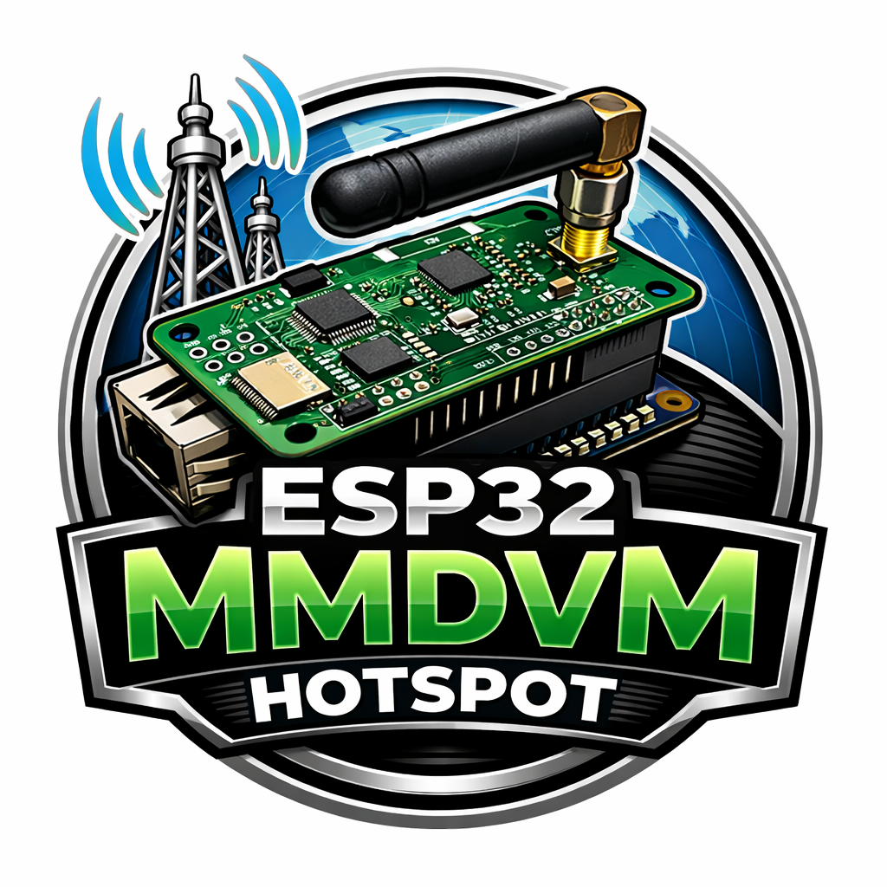

# ESP32 MMDVM Hotspot

<p align="center">
  
</p>

A FreeRTOS-based ESP32 firmware for a multi-mode digital voice modem hotspot. Designed for amateur radio operators, it currently supports DMR (network→RF transmit), POCSAG, and DAPNET, with a responsive web interface, MQTT integration, WireGuard VPN, SD card database support, and over-the-air firmware updates.


## Current Firmware Version

| Channel | Version |
|---------|---------|
| Stable  | `20260301_ESP32` |
| Beta    | `20260301_ESP32_BETA` |


## Implemented Modes

| Mode | Status | Notes |
|------|--------|-------|
| **DMR** | ⚠️ Partial | Network→RF TX working. RF→Network RX is work in progress. |
| **POCSAG** | ✅ Implemented | RF paging transmitter, queue management, whitelist/blacklist |
| **DAPNET** | ✅ Implemented | TCP paging network, message history, RIC filtering |
| D-Star | ❌ Not in firmware | Framework stub only |
| YSF (System Fusion) | ❌ Not in firmware | Framework stub only |
| P25 | ❌ Not in firmware | Framework stub only |
| NXDN | ❌ Not in firmware | Framework stub only |


## Features

### Radio & Protocols


### Network Connectivity


### Time & Synchronisation


### Web Interface


### MQTT Integration


### Firmware Updates


### Storage


### Display & Indicators


### Monitoring & Logging


### Configuration Management


## Hardware Requirements


## Default Pin Configuration

| Function | Pin | Notes |
|----------|-----|-------|
| MMDVM TX | 43 | UART to modem |
| MMDVM RX | 44 | UART from modem |
| MMDVM Boot | 4 | Bootloader trigger |
| MMDVM Reset | 13 | Hard reset |
| OLED SDA | 17 | I2C data |
| OLED SCL | 18 | I2C clock |
| LED | 38 | Status indicator |
| Button | 0 | OLED toggle |
| SD MISO | 9 | SPI |
| SD MOSI | 11 | SPI |
| SD SCLK | 10 | SPI |
| SD CS | 12 | SPI |
| ETH MISO | 47 | W5500 SPI |
| ETH MOSI | 21 | W5500 SPI |
| ETH SCLK | 48 | W5500 SPI |
| ETH CS | 45 | W5500 SPI |
| ETH INT | 14 | W5500 interrupt |

All pins are configurable via the web interface.


## Default Credentials

| Setting | Default |
|---------|---------|
| Web username | `admin` |
| Web password | `pi-star` |
| WiFi AP SSID | `MMDVM-Setup` |
| WiFi AP password | `mmdvm1234` |
| ArduinoOTA password | `mmdvm` |
| DMR callsign | `N0CALL` |
| DMR ID | `1234567` |


## Getting Started

1. Flash the firmware to your ESP32
2. Connect to the `MMDVM-Setup` WiFi access point (password: `mmdvm1234`)
3. Open a browser and navigate to `http://192.168.4.1`
4. Log in with `admin` / `pi-star`
5. Go to **Network → WiFi** and configure your home WiFi credentials
6. Go to **Modes → DMR** and set your callsign and DMR ID
7. Go to **Mode Select** and enable DMR
8. Reboot — the hotspot will connect to BrandMeister


## Web Interface Pages

| Page | URL | Description |
|------|-----|-------------|
| Home | `/` | Overview and first-time setup wizard |
| Status | `/system-status` | System metrics, network, modem, MQTT, WireGuard |
| Settings | `/system-settings` | Settings menu aggregator |
| Mode Select | `/mode-select` | Enable / disable radio protocols |
| DMR | `/mode-dmr` | Callsign, DMR ID, SSID, server, frequencies, color code |
| POCSAG / DAPNET | `/mode-pocsag` | Frequency, DAPNET server/auth, RIC, whitelist/blacklist |
| D-Star | `/mode-dstar` | Placeholder — not yet implemented |
| YSF | `/mode-ysf` | Placeholder — not yet implemented |
| P25 | `/mode-p25` | Placeholder — not yet implemented |
| NXDN | `/mode-nxdn` | Placeholder — not yet implemented |
| WiFi | `/system-wifi` | 6-slot credential management, AP settings, WiFi scan |
| Firmware | `/system-firmware` | OTA download/flash for ESP32 and modem |
| Admin | `/system-admin` | Logs, factory reset, service restart, reboot |
| MQTT | `/system-mqtt` | Broker, auth, topics, hardware interval, command token |
| WireGuard | `/system-wireguard` | Keys, endpoint, DNS, allowed IPs |
| SD Card | `/system-sdcard` | Status, database download/sync, file browser |
| Serial Monitor | `/system-serialmonitor` | MMDVM UART settings, baud rate, pins |
| System Info | `/system-info` | Chip model, memory, partitions |
| RF Settings | `/settings-mmdvm` | RX/TX frequency, color code, RF power, CW ID |


## MQTT Commands

When MQTT is enabled the device subscribes to the configured command topic. **A token is always required** — commands without a valid token are rejected. Configure a token under **System → MQTT → Command Token**.

```json
{"cmd": "reboot", "token": "your_token"}
{"cmd": "get_hardware", "token": "your_token"}
{"cmd": "get_status", "token": "your_token"}
```

| Command | Description |
|---------|-------------|
| `reboot` | Restart the ESP32 immediately |
| `get_hardware` | Publish hardware info JSON to the hardware topic |
| `get_status` | Publish `{"status":"online","uptime_seconds":N}` to the status topic |

On connect the device publishes an announce message listing all available commands and confirming that a token is required.


## RTOS Architecture

The firmware runs on FreeRTOS with tasks pinned to specific cores:


A separate low-priority **DMR Database** task runs on Core 0 and performs blocking SQLite / HTTP lookups asynchronously so DMR keepalives are never delayed.


## Configuration

Settings are stored in NVS (Non-Volatile Storage) and persist across reboots. Compile-time defaults live in `include/config.h`. Priority order:

1. NVS (set via web interface or config import)
2. `config.h` defaults (compile-time fallback)

Configuration can be exported as a `key=value` text file and re-imported, or saved as named snapshots on SD card or LittleFS.


## License

Amateur radio use. See LICENSE file for details.
 # ESP32 MMDVM Hotspot

 A modular, web-configurable, multi-mode digital voice and paging hotspot for amateur radio, built on ESP32 with FreeRTOS. Supports DMR, D-STAR, YSF, P25, NXDN, POCSAG, DAPNET, MQTT, WireGuard VPN, and more.

 ## Project Overview

 - **Platform:** ESP32 (FreeRTOS, Arduino framework)
 - **Web UI:** Responsive, modern interface for configuration, monitoring, and management
 - **Storage:** Internal flash (LittleFS) and SD card support
 - **Firmware Updates:** OTA for both ESP32 and MMDVM modem
 - **Security:** WireGuard VPN, user authentication

 ## Main Folders (excluding legacy, Python, and shell scripts)

 ### web/pages/

 #### Pages (UI Screens)
 - **main.h**: Main dashboard and landing page. Shows callsign, device hostname, feature highlights, and setup wizard for first-time users.
 - **system_files.h**: System Files page. File browsers for LittleFS and SD card, bootlogos installer, and file management tools.
 - **system_status.h**: System Status page. Live status cards for station info, WiFi, Ethernet, MMDVM hardware, and more.
 - **system_info.h**: System Information page. Hardware, firmware, memory, and task details.
 - **system_hardware.h**: Hardware Settings page. Configure GPIO pins, OLED, SD card, and save/reboot controls.
 - **mode_*.h, service_*.h**: Additional pages for each digital mode and service (DMR, D-STAR, YSF, P25, NXDN, POCSAG, DAPNET, MQTT, Telegram, WireGuard).

 #### Cards (Dashboard/Info Cards)
 - **Main Page**: "On Air" status, Last 15 Calls, DAPNET Messages, POCSAG Queue.
 - **System Files**: LittleFS File Browser, SD Card Browser, Bootlogos Installer.
 - **System Status**: Station Information, WiFi Status, Ethernet Status, MMDVM Hardware Status.
 - **System Info**: System Hardware, Memory, Task Stack Usage, All Tasks.
 - **System Hardware**: LED & Button Settings, OLED Settings, SD Card Settings.

 ### system/

 - **system_*.h/cpp**: Core system modules for WiFi, Ethernet, webserver, OLED, SD card, logger, NTP, firmware, modem, etc.
 - **web_handlers_*.h/cpp**: HTTP API endpoint handlers for admin, config, WiFi, bootlogos, snapshots, and more.

 ### include/

 - **config.h**: Central configuration header for all system and hardware settings.

 ### firmware/, mmdvm/, src/, images/, boards/, factory-setup/

 - **firmware/**: MMDVM modem firmware.
 - **mmdvm/**: Digital voice protocol implementations.
 - **src/**: Additional source code (e.g., WireGuard).
 - **images/**: Bootlogos and UI assets.
 - **boards/**: Board definitions.
 - **factory-setup/**: Factory setup sketches and configs.

 ## Web UI Features

 - **Navigation**: Sidebar/menu for all pages.
 - **Live Status**: Real-time cards for radio activity, hardware, and network.
 - **File Management**: Upload, download, delete, and organize files on both flash and SD card.
 - **Bootlogos**: Download and install logo packs directly from the web UI.
 - **Hardware Settings**: Configure pins and peripherals with instant feedback.
 - **OTA Updates**: Update firmware for both ESP32 and modem from the browser.
 - **Snapshots**: Save/load full configuration snapshots to flash or SD card.

## License

**Amateur Radio Non-Commercial License**

This project is open source for amateur radio use only. 

**You are free to:**
- Use the software for amateur radio operations
- Study, modify, and improve the code
- Share and distribute modifications
- Contribute improvements back to the project

**Under the following conditions:**
- **Non-Commercial:** You may NOT use this software for commercial purposes
- **Amateur Radio Only:** This software is intended exclusively for licensed amateur radio operators
- **Attribution:** You must give appropriate credit to the original authors (PD2EMC & PD8JO)
- **Share Alike:** If you modify and distribute this software, you must use the same license

**Specifically prohibited:**
- Commercial sale of this software or derivatives
- Commercial hardware products using this software without explicit permission
- Use by unlicensed individuals for radio transmission
- Any commercial exploitation of the codebase

**Legal Requirements:**
- Valid amateur radio license required for operation
- Compliance with local radio regulations mandatory
- Proper station identification required per your jurisdiction

For commercial licensing inquiries, contact the authors.

## Resources and Documentation

### Official Resources
- **MMDVM Project:** https://github.com/g4klx/MMDVM
- **MMDVMHost:** https://github.com/g4klx/MMDVMHost  
- **BrandMeister Network:** https://brandmeister.network/
- **Pi-Star:** https://www.pistar.uk/
- **ESP32 Arduino:** https://github.com/espressif/arduino-esp32

### Hardware Vendors
- **JumboSPOT:** https://www.amateurwireless.com/
- **MMDVM_HS:** https://github.com/juribeparada/MMDVM_HS
- **ZUMspot:** https://www.zumspot.com/

### DMR Resources  
- **RadioID.net Database:** https://radioid.net/
- **BrandMeister Dashboard:** https://brandmeister.network/

---

**73 and enjoy your ESP32 MMDVM Hotspot!**

*This project is for licensed amateur radio operators only. Not for commercial use.*

**Developed by PD2EMC & PD8JO**