# ESP32 MMDVM — Boot Logo Pack

Boot logos for the SSD1306 128×64 OLED display on the ESP32 MMDVM Hotspot.
Each logo ships as a **PNG preview** and a ready-to-flash **binary** (`.bin`).

> 📂 **[Open the interactive gallery →](index.html)**
> Open `index.html` in your browser to preview all logos and download the `.bin` files.

---

## How It Works

The firmware checks LittleFS for `/bootlogo.bin` at startup.
If found (and exactly **1024 bytes**), it is displayed instead of the built-in logo.

**Binary format:** raw 1-bit-per-pixel, 128×64 pixels, MSB-first, row-major — total 1024 bytes.

---

## Activating a Logo

1. Download the `.bin` file for the logo you want.
2. **Rename it to `bootlogo.bin`.**
3. Upload `bootlogo.bin` to the **root** of LittleFS (internal flash) using the **Internal Flash Browser** card in the System Admin page.
4. Reboot — the new logo appears at startup.

To restore the built-in default logo, simply delete `/bootlogo.bin` from the LittleFS root.

---

## Available Logos

| # | Preview | File |
|---|---------|------|
| 1 | 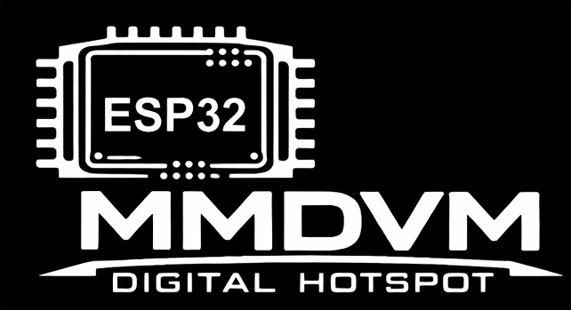 | [bootlogo_1.bin](bootlogo_1.bin) |
| 2 | 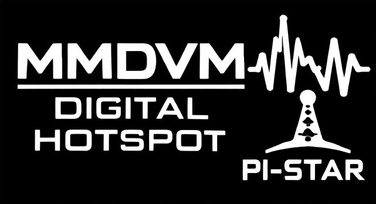 | [bootlogo_2.bin](bootlogo_2.bin) |
| 3 | 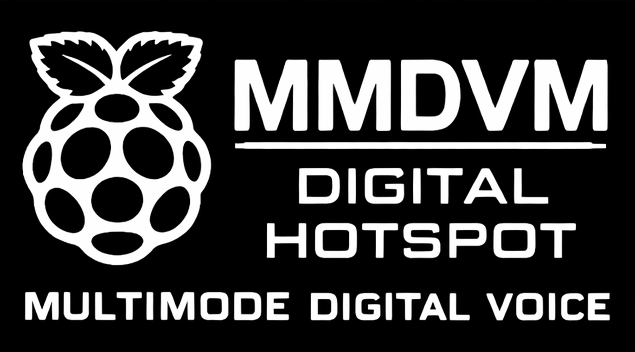 | [bootlogo_3.bin](bootlogo_3.bin) |
| 4 | 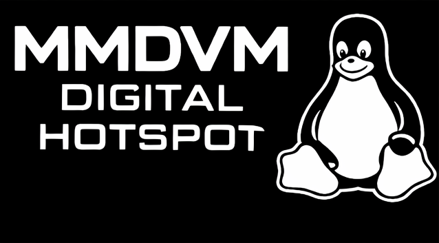 | [bootlogo_4.bin](bootlogo_4.bin) |
| 5 | 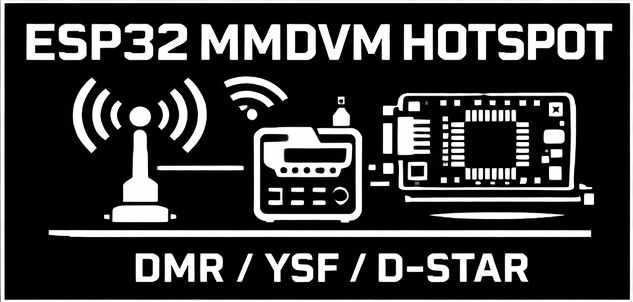 | [bootlogo_5.bin](bootlogo_5.bin) |
| 6 | 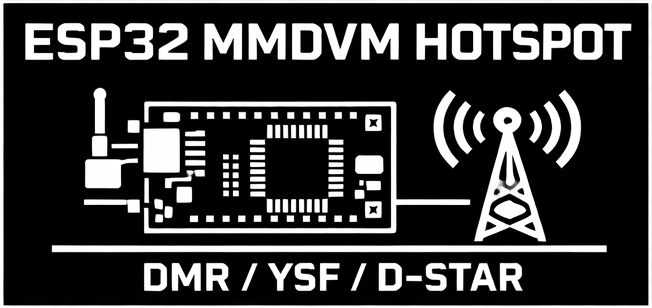 | [bootlogo_6.bin](bootlogo_6.bin) |
| 7 | 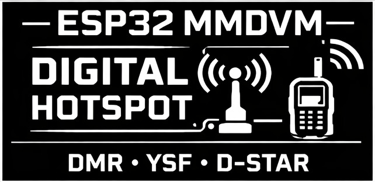 | [bootlogo_7.bin](bootlogo_7.bin) |
| 8 | 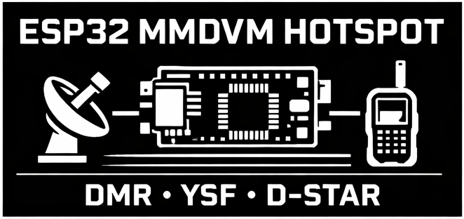 | [bootlogo_8.bin](bootlogo_8.bin) |
| 9 | 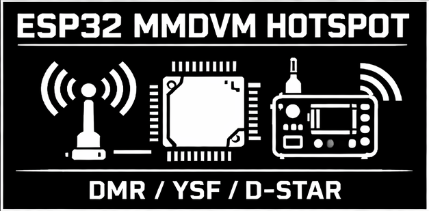 | [bootlogo_9.bin](bootlogo_9.bin) |
| 10 | 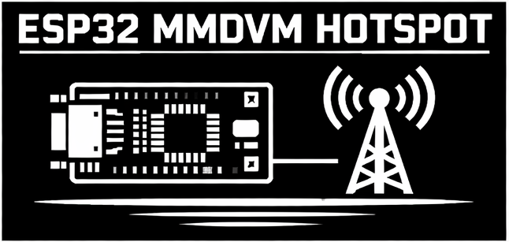 | [bootlogo_10.bin](bootlogo_10.bin) |
| 11 | 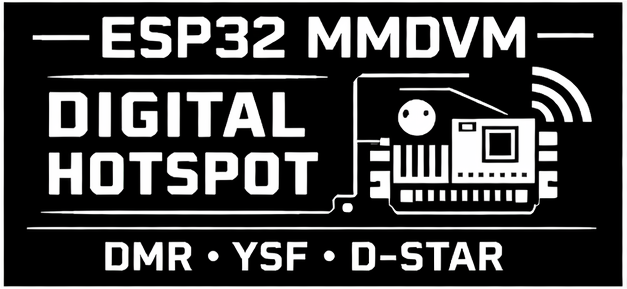 | [bootlogo_11.bin](bootlogo_11.bin) |
| 12 | 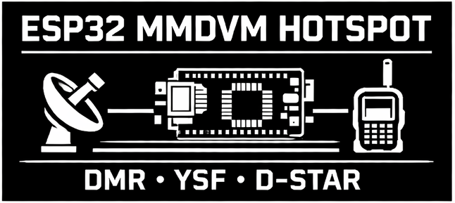 | [bootlogo_12.bin](bootlogo_12.bin) |

---

## Creating Your Own Logo

You need [ImageMagick](https://imagemagick.org) installed.

### macOS (Homebrew)
```bash
brew install imagemagick
```

### Convert any image to a boot logo binary

```bash
magick your_image.png \
  -resize 128x64! \
  -monochrome \
  -depth 1 \
  -endian MSB \
  GRAY:bootlogo_custom.bin
```

| Flag | Meaning |
|------|---------|
| `-resize 128x64!` | Force-fit to exactly 128×64 (ignores aspect ratio) |
| `-monochrome` | Convert to pure black & white |
| `-depth 1` | 1 bit per pixel |
| `-endian MSB` | Most-significant-bit first (required by SSD1306) |
| `GRAY:` prefix | Raw grayscale binary output |

The output **must be exactly 1024 bytes** — the firmware rejects any other size.

### Verify the size
```bash
ls -la bootlogo_custom.bin
# Should show: 1024 bytes
```

### Tips for best results
- Start with a **high-contrast** image — dark background, bright subject.
- The display is **128×64** but very small (~0.96″ or 1.3″) — keep designs simple.
- Avoid fine detail or thin lines; they disappear at 1-bit depth.
- Use ImageMagick's `-threshold 50%` before `-monochrome` to control the dither point.

### Convert with custom threshold
```bash
magick your_image.png \
  -resize 128x64! \
  -threshold 50% \
  -depth 1 \
  -endian MSB \
  GRAY:bootlogo_custom.bin
```

### Batch convert (Linux / macOS)
```bash
for f in *.png; do
  name="${f%.png}"
  magick "$f" -resize 128x64! -monochrome -depth 1 -endian MSB GRAY:"${name}.bin"
  echo "Created ${name}.bin"
done
```

---

## File Naming

The local gallery (`index.html`) auto-discovers files named `bootlogo_N.png` / `bootlogo_N.bin`
(where N is 1–50) — this is just for previewing options locally in your browser.

The **ESP32 firmware only ever reads one file: `/bootlogo.bin` from the root of LittleFS.**
Pick whichever logo you like, download the `.bin`, rename it to `bootlogo.bin`, and upload it to the LittleFS root.

---

## License

Logo designs are provided as-is for personal use with the ESP32 MMDVM Hotspot project.
